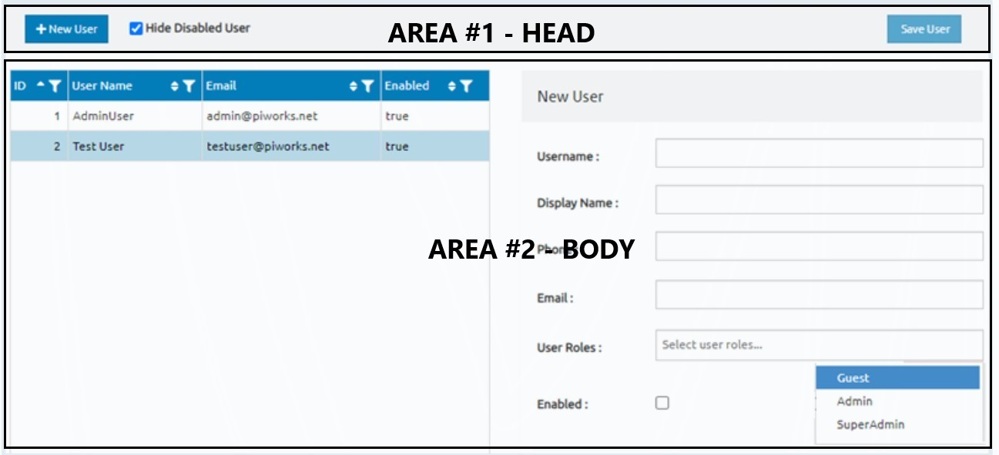

# 
User Management Screen UI Specification Document

---

## Sections

---
- [About Page](#about-page)

- [Head Area](#1-head-area)

- - [New User Button](#11-new-user-button)

- - [Check Box and Text](#12-check-box-and-text)

- - [Save User Button](#13-save-user-button)

- [Body Area](#2.-body-area)

- - [Table Area](#21-table-area)

- - - [Table Head](#211-table-head)

- - - [Table Body](#212-table-body)
    
- - [Sign-up Area](#22-sign-up-area)

- - - [Card Block](#221-card-block)

- - - [Labels and Inputs](#222-labels-and-inputs)

- - - [Label and Check-box](#223-label-and-check-box)

---

> ## About Page

This page, the user management screen: Performs the functions of adding a new user and viewing the information of registered users.

The page basically consists of 2 area:

> ## 1. Head Area
---
- Head Area Design

    Bg-Color: Grey

- Has

    3 Elements:

    - ### 1.1 New User Button 

        

        - New User Button Design

            -Bg-Color: Blue

            -Text and Icon color: White
        
            -Location: Align left
        
        - Has

            -Icon: “Plus”
        
            -Text: “New User”

        - Actions

            When the button is pressed, the cursor will show the first empty space in the user add section.

    - ### 1.2 Check box and Text

        

        - Design

            Check-box Bg-color: Blue

            Text color: Black

        
            -Location: Next to New User button (First check-box then text)
        
        - Has
        
            -Text: “Hide Disabled User”

        - Actions

            o	If selected:

            The users who checked the enable option in the sign-up menu are listed on the screen.

            o	Else:

            All users are listed on the screen.
    
    - ### 1.3 Save User Button 

        

        - Save User Button Design

            -Bg-color: Blue
        
            -Text color: White
        
            -Location: Align right

        
        - Has
                
            -Text: “Save User”

        - Actions
        
            o	If fields OK:
            
            Kullanýcý sisteme kaydedilir.
            
            o	Else:
            
            Kullanýcý sisteme kaydedilmez,
            Butona týklanamaz.

> ## 2. Body Area
---
- There are two sections in this section: Data Table and Sign-Up Form.
    
    The two sections should have equal space on the page. On the left side should be a table showing the users' information, on the right side should be a user registration form.

    

   - ### 2.1 Table Area

        - #### 2.1.1 Table Head
            
            
            
            - Thead Design
            
                Bg-Color: Blue

            - Has
        
        
                4 Columns:

                1  ID:
                    A unique id number starting from 1 is defined for each registered user.

                2  User Name:
                    It is the Username information the user's chosed when registering.

                3 Email
                    It is the Email information the user's chosed when registering.
                
                4 Enabled
                    it is the option information the user's chosed when registering.
                
                Each column has 3 elements:
                    
                
        
                
                1 . Text
                    
                    + Text design
                    
                        Color: White
                        
                        Location: Align left

                2 . Arrow up/down icon

                    + Arrow up/down icon design

                        Color: White
                        
                        Location: Align right
                    
                    + Actions

                        When pressed, lists in descending or ascending order for numbers and in alphabetical order for texts.

                
                3 .	Filter icon

                    + Filter icon design

                        Color: White
                        
                        Location: Align right

                    + Actions

                        When pressed, lists data for spesific filter properties.

        - #### 2.1.2 Table Body
        

            

            - Tbody Design

                Bg-color: White
                
                Text color: Black
                
                Location: ID datas align right, other datas align left

            - Action

                Selected row bg-color: Light blue

   - ### 2.2 Sign Up Area

        - #### 2.2.1 Card Block 

            

            - Card-block design

                Bg-color: Grey
                
                Text color: Black

            - Has

                Text: "New User"
            
        - #### 2.2.2 Labels and Inputs

            

            - Design

                Text color: black
                
                Location: Under Card-block

            - Has

                Text: “Username”, “Display Name”, “Phone”, “Email”, “User Roles”
            
                User roles Input: Select Input has 3 Options
            
                1. Quest
            
                2. Admin
            
                3. SuperAdmin

        - #### 2.2.3 Label and Check Box

            

            - Design

                Text color: black
                
                Location: Under Labels and inputs

            - Has

                Text: “Enabled”
                
                Check-box

- [Back To Top](#user-management-screen-ui-specification-document)

